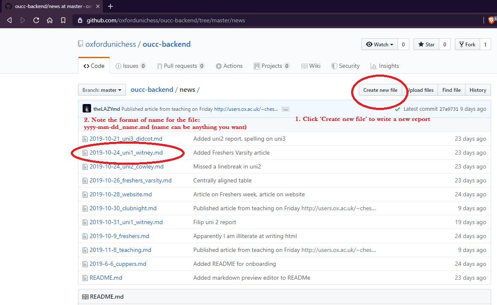

# Onboarding

If you've used git before, just go ahead and fork the repository! Otherwise read the follwoing steps to learn how to do it.

## Getting Started

Set up your workdpace for adding your file is really easy, just press the 'Create new file' button. To edit an old file, just click on it.

## Adding details to your file

There's three elements you need to add to your file.

### 1. The filename

Should be in 

## Here's where I'd write the header, ex: Intro to editing on GitHub

### Here's where I'd write the subheader, traditionally date and author such as:
### November 22nd 2019 - by Aloysius Lip

Then the text of 

## Editing format

Copy and paste the [template](https://github.com/oxfordunichess/oucc-backend/blob/master/news/yyyy-mm-dd_TEMPLATE.md) to get started easily.

So all these articles are written in **markdown** and automatically compiled to the website. Markdown is just a super easy way to format things, you're probably already familiar with it from popular messaging sites such as *Reddit*, *WhatsApp*, or *Discord*. It's just really basic things, like:

- Begin each document with a `## Your Title` and then a `### Date - Your Name` subtitle.
- `**bold**` text is written with two stars around it.
- `*italic*` text is written with one star.

### Images

Should be done in the format:

``

or `.png` or whatever file-extension. Upload your image to the `/images` folder. Alternatively you can link to an external site by replacing the entire content in the `()`. Example:

``
``

### Further Reference

Check [this document](https://github.com/adam-p/markdown-here/wiki/Markdown-Cheatsheet) if you want to see a full reference.

Alternatively, use this [markdown preview editor](https://stackedit.io/app) to see how your formatting would directly render. Just type what you see!